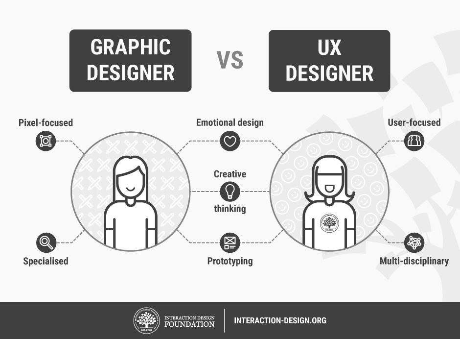

# Building HTML Structure for Web Pages

- HTML, short for "HyperText Markup Language", is a standardized system for tagging text files to achieve font, color, graphic, and hyperlink effects on web pages.
- Content is wrapped (or marked-up) in "tags" (a.k.a. elements).
- HTML creates a Hierarchy
- HTML allows content to be displayed in blocks or boxes
- ***Note:*** _It's best practice in the coding industry to use lowercase characters in HTML._

## HMTL Tags

- Tags surround the _content_ they describe. For example:
    > `
We're discussing HTML tags today.
`

- Most have _opening_ tags: `
` and _closing_ tags: `
`.
- Tags tell the browser _what_ the content is:
  - Paragraph text `
...
`
  - Headings `<h1>...</h1>`
  - Navigation `<nav>...</nav>`
  - Article `<article>...</article>`
  - Footer `<footer>...</footer>`
- Tags help organize the content. For example:
   > 

# Wireframing

 Wireframing is a practice used by UX designers to allow them to define and plan the information hierarchy of their design for a website, app, or product. The process itself is very multi-disciplinary and user-focused.

 > 

**Here are some helpul wireframing notes:**

- When designing for the screen you need to know where all the information is going to go in plain black and white diagrams before building anything with code—whether that’s a developer coding it, or you the designer.
- Without the distractions of colors, typeface choices or text, wireframing lets you plan the layout and interaction of your interface.
- Wireframes drawn with paper and a pencil, or at a whiteboard, have the advantage of looking and being very easy to change, which can help tremendously in early conversations about your website or product.
- Switching later to software (after initially hand-drawing your wireframe) allows you to keep track of more detailed decisions.
- Here are some excellent examples of wireframing: <https://careerfoundry.com/en/blog/ux-design/website-app-wireframe-examples/>.

### Tools for Wireframing

You can draw with a pen and paper or you can use some of [these wireframe tools](https://careerfoundry.com/en/blog/ux-design/free-wireframing-tools/). Give it a try!

### 6 Steps to Make a Wireframe

_Source_: <https://careerfoundry.com/en/blog/ux-design/how-to-create-your-first-wireframe/#do-your-research>

> 

1. Do your research
2. Prepare your research
3. Make sure you have your user flow mapped out
4. Draft, don't draw. Sketch, don't illustrate
5. Add some detail and get testing
6. Start turning your wireframes into prototypes**

## Semantics

In programming, Semantics refers to the meaning of a piece of code — for example "what effect does running that line of JavaScript have?", or "what purpose or role does that HTML element have" (rather than "what does it look like?".)

- In HTML, for example, the heading 1 (`<h1>...</h1>`) element is a semantic element, which gives the text it wraps around the role (or meaning) of "a top level heading on your page."

  - On the other hand, you could make any element look like a top level heading. Consider the following:

    > `Is this a top level heading?`

## Navigation

- [About Me](/README.md)
- [Growth Mindset](/Growth_Mindset.md)
- [What is Markdown?](/Learning_Markdown.md)
- [Coder's Computer](/CodersComputer.md)
- [Revisions and the Cloud](/RevisionsandCloud.md)
- [Using HTML to Structure Webpages](/HTML_Structure.md)
